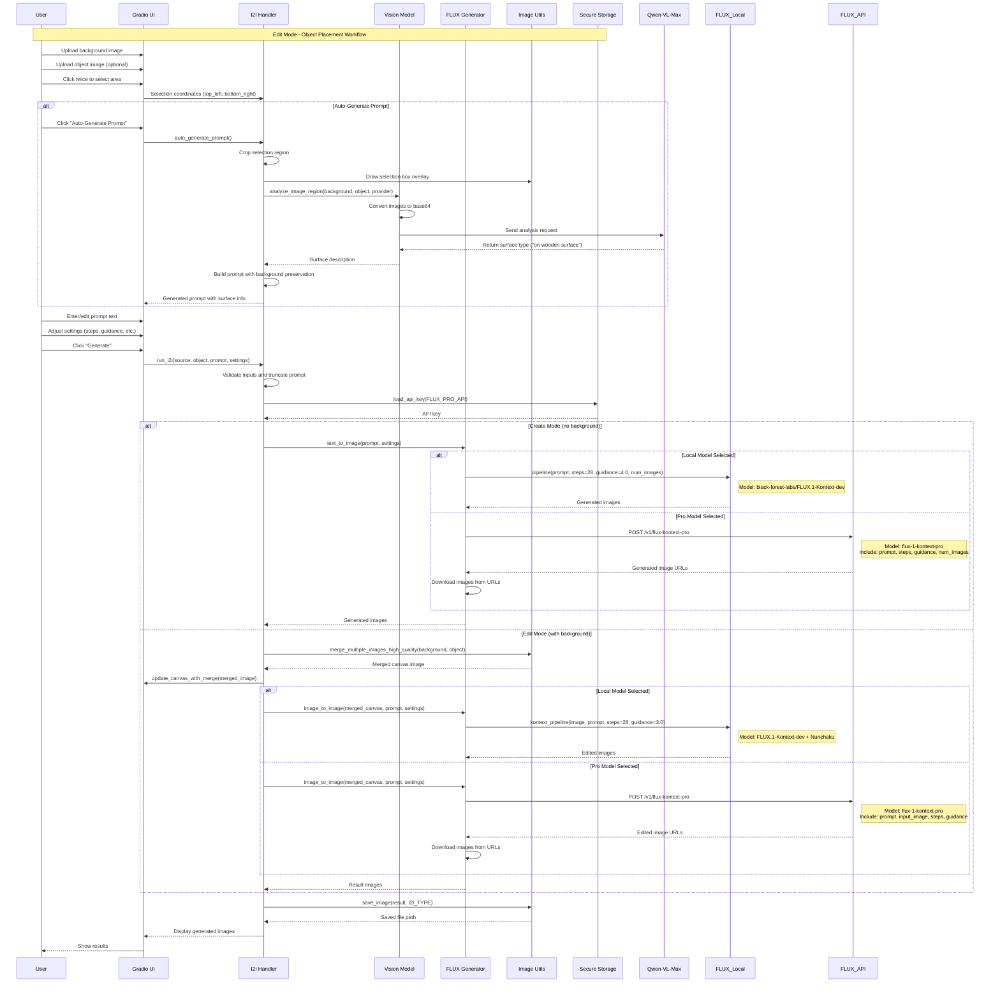
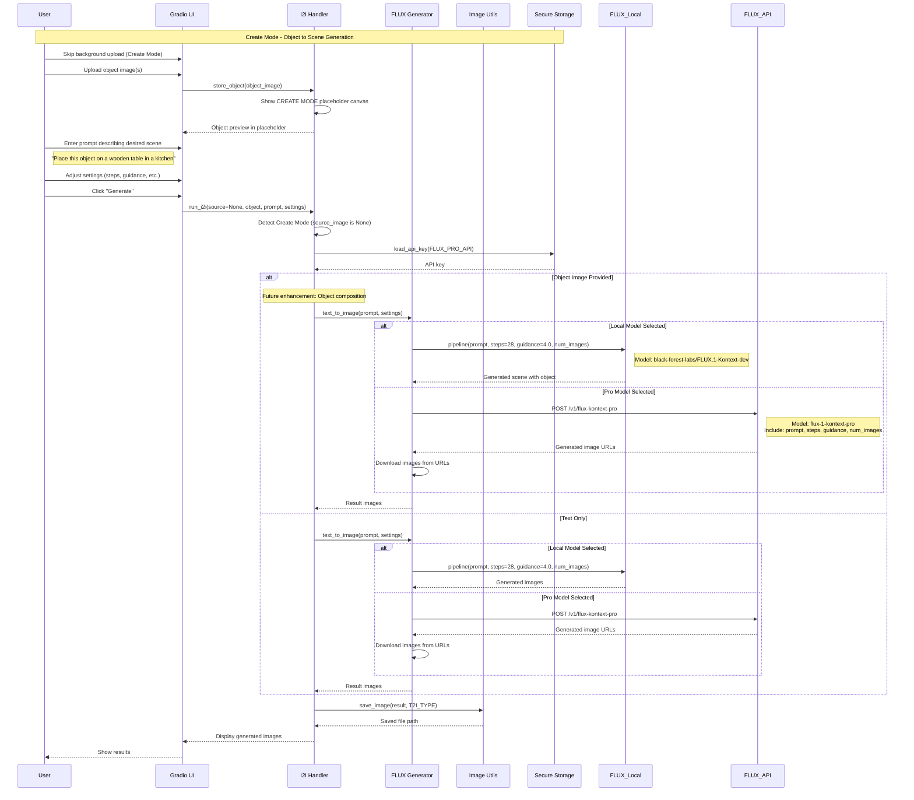
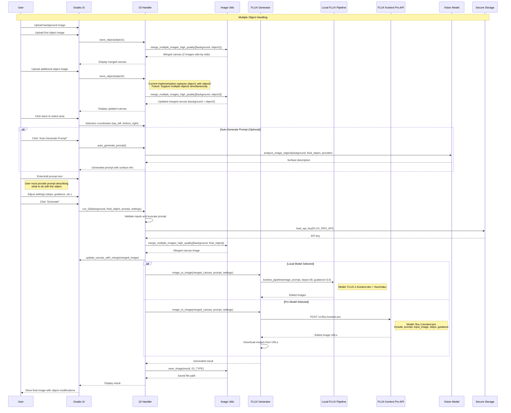
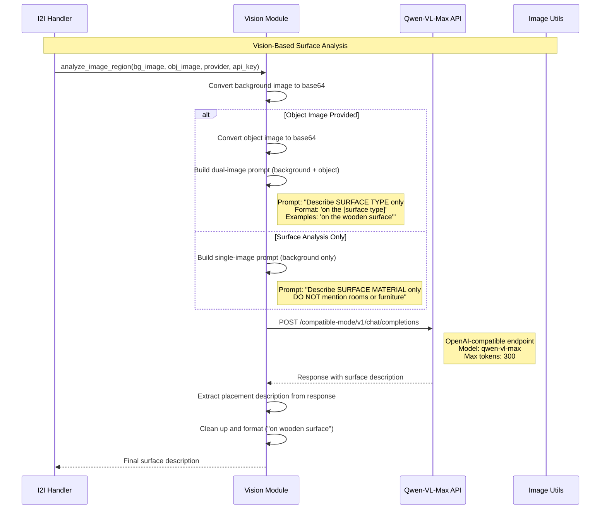
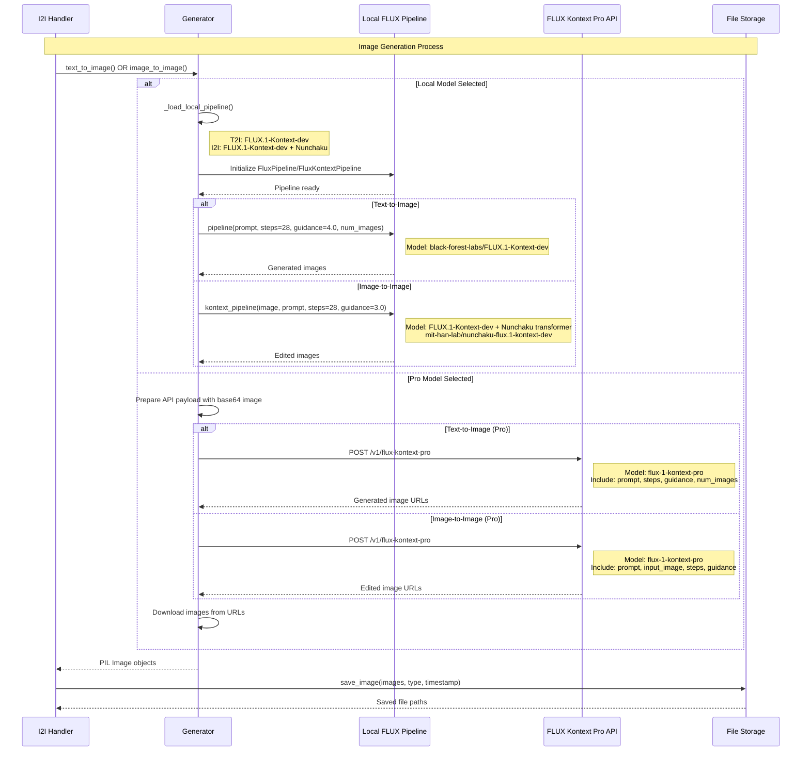
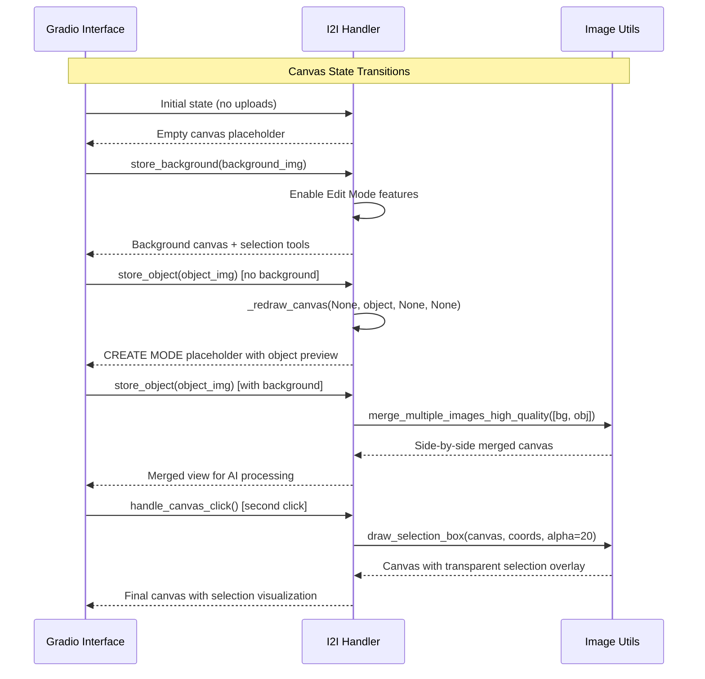
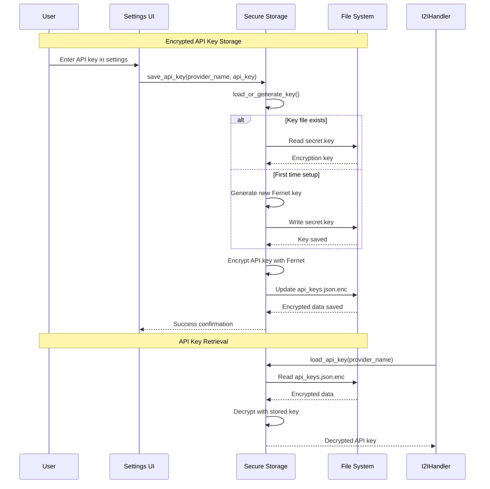
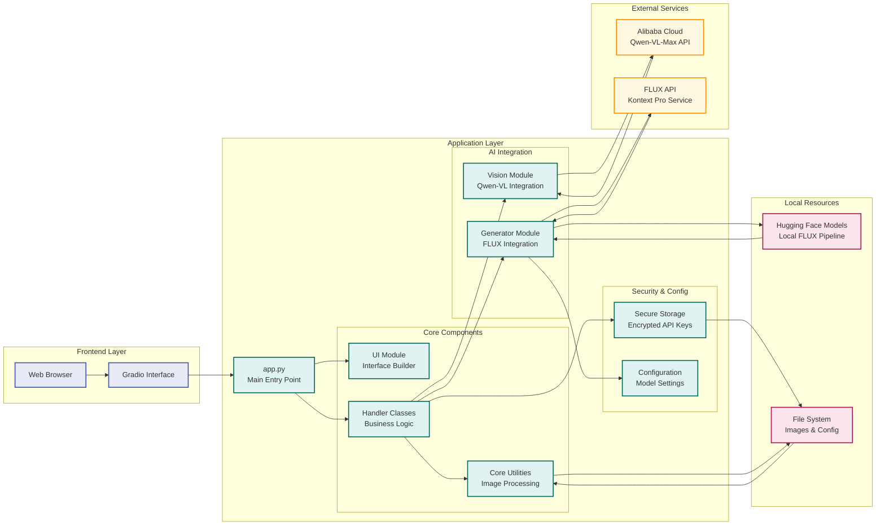

# PhotoGen App v3 - Sequence Diagrams

## Overview
This document contains sequence diagrams for the main workflows in the PhotoGen application.

## 1. Image-to-Image (I2I) Edit Mode Workflow



## 1a. Create Mode - Object Only Workflow



## 1b. Multi-Object Workflow



## 2. Vision Analysis Workflow (Detailed)



## 3. Image Generation Workflow (FLUX Models)



## 4. UI Canvas Update Workflow

```mermaid
sequenceDiagram
    participant User
    participant UI as Gradio Interface
    participant I2IHandler as I2I Handler
    participant Utils as Image Utils

    Note over User, Utils: Complete Canvas Management Workflow

    %% Initial Canvas Setup
    alt Create Mode (No Background)
        User->>UI: Skip background upload
        UI->>I2IHandler: store_background(img=None)
        I2IHandler->>I2IHandler: _redraw_canvas(None, None, None, None)
        I2IHandler->>I2IHandler: Create CREATE MODE placeholder (512x512)
        I2IHandler->>I2IHandler: Draw dashed borders and instructions
        I2IHandler-->>UI: Placeholder canvas with "CREATE MODE" text
        UI-->>User: Show placeholder canvas
    else Edit Mode (Background Uploaded)
        User->>UI: Upload background image
        UI->>I2IHandler: store_background(background_img)
        I2IHandler->>I2IHandler: Detect Edit Mode
        I2IHandler-->>UI: Background canvas + enable area selection
        UI-->>User: Show background image ready for editing
    end

    %% Object Upload and Canvas Merge
    alt Object Image Added
        User->>UI: Upload object image
        UI->>I2IHandler: store_object(object_img)
        
        alt Edit Mode with Background
            I2IHandler->>Utils: merge_multiple_images_high_quality([background, object])
            Utils->>Utils: Resize to same height using LANCZOS
            Utils->>Utils: Create side-by-side horizontal layout
            Utils-->>I2IHandler: Merged canvas image
            I2IHandler-->>UI: update_canvas_with_merge(merged_canvas)
            UI-->>User: Show merged view (background | object)
        else Create Mode
            I2IHandler->>I2IHandler: _redraw_canvas(None, object, None, None)
            I2IHandler->>I2IHandler: Show object preview in placeholder
            I2IHandler->>I2IHandler: Add object preview with white border
            I2IHandler-->>UI: Placeholder with object preview
            UI-->>User: Show CREATE MODE canvas with object
        end
    end

    %% Area Selection Process
    User->>UI: Click on canvas (first click)
    UI->>I2IHandler: handle_canvas_click(click_coords, current_state)
    I2IHandler->>I2IHandler: Validate click coordinates
    I2IHandler->>I2IHandler: Apply edge tolerance and snapping
    I2IHandler->>I2IHandler: Store top_left coordinates
    I2IHandler-->>UI: Status: "Selection started at (x, y)"
    
    User->>UI: Click on canvas (second click)
    UI->>I2IHandler: handle_canvas_click(click_coords, current_state)
    I2IHandler->>I2IHandler: Store bottom_right coordinates
    I2IHandler->>I2IHandler: Calculate selection area dimensions
    I2IHandler->>I2IHandler: Ensure minimum box size (10x10 pixels)
    I2IHandler-->>UI: Status: "Selection completed! Area: WxH pixels"
    
    %% Canvas Redraw with Selection Box
    I2IHandler->>I2IHandler: _redraw_canvas(base_img, obj_img, top_left, bottom_right)
    
    alt Background + Object Available
        I2IHandler->>Utils: merge_multiple_images_high_quality([bg, obj])
        Utils-->>I2IHandler: Merged canvas
        I2IHandler->>Utils: draw_selection_box(canvas, coords, alpha=20)
        Note right of Utils: Transparent blue rectangle<br/>Color: (0, 100, 255, 20)
        Utils-->>I2IHandler: Canvas with transparent selection overlay
        I2IHandler-->>UI: update_canvas_with_merge(canvas_with_selection)
    else Background Only
        I2IHandler->>Utils: draw_selection_box(bg_image, coords, alpha=20)
        Utils-->>I2IHandler: Background with selection box
        I2IHandler-->>UI: Updated canvas
    else Create Mode
        I2IHandler->>I2IHandler: Show placeholder with selection indicators
        I2IHandler-->>UI: CREATE MODE canvas (no selection box)
    end
    
    %% Reset Selection
    alt User Resets Selection
        User->>UI: Click "Reset Selection" button
        UI->>I2IHandler: reset_selection()
        I2IHandler->>I2IHandler: Clear top_left and bottom_right
        I2IHandler->>I2IHandler: _redraw_canvas(base_img, obj_img, None, None)
        I2IHandler-->>UI: Canvas without selection box
        I2IHandler-->>UI: Status: "Ready to select areas 🎯"
        UI-->>User: Clean canvas ready for new selection
    end
    
    UI-->>User: Display final updated canvas
```



## 4a. Canvas State Management



## 5. API Key Management Workflow



## 6. Complete PhotoGen Application Workflow

```mermaid
graph TB
    %% User Interface Layer
    subgraph UI_LAYER ["User Interface Layer"]
        direction TB
        subgraph UI_COMPONENTS ["Gradio Web Interface"]
            UI[Main Interface]
            BG_UP[Background Upload]
            OBJ_UP[Object Upload]
            CANVAS[Interactive Canvas]
            PROMPT[Prompt Input]
            SETTINGS[Model Settings]
            GENERATE[Generate Button]
            RESULTS[Results Display]
        end
        
        subgraph OUTPUT_CONTROLS ["Output Parameter Controls"]
            NUM_IMAGES[Number of Images<br/>Slider: 1-4]
            ASPECT_RATIO[Image Dimensions<br/>Match Input, 1:1, 16:9, etc.]
            STEPS[Inference Steps<br/>Slider: 1-50, Default: 20]
            GUIDANCE[Guidance Scale<br/>Slider: 0-10, Default: 3.0]
            MODEL_SELECT[Model Selection<br/>Local vs Pro API]
        end
    end
    
    %% Core Application Layer
    subgraph CORE_LAYER ["Core Application Layer"]
        direction TB
        subgraph HANDLERS ["Request Handlers"]
            I2I_H[I2I Handler<br/>Main Orchestrator]
            DEMO_H[Demo Handler<br/>Showcase Features]
            T2I_H[T2I Handler<br/>Text Generation]
        end
        
        subgraph CORE_MODULES ["Core Processing Modules"]
            VISION[Vision Module<br/>Surface Analysis]
            GEN[Generator Module<br/>FLUX Interface]
            UTILS[Image Utils<br/>Merge & Processing]
            STORAGE[Secure Storage<br/>API Key Management]
            UI_CORE[UI Core<br/>Interface Builder]
        end
        
        subgraph CONFIG_LAYER ["Configuration Management"]
            CONFIG[config.yaml<br/>Model Settings]
            CONST[Constants<br/>API Endpoints]
        end
    end
    
    %% External Services Layer
    subgraph EXTERNAL_LAYER ["External AI Services"]
        direction LR
        QWEN[Qwen-VL-Max API<br/>Vision Analysis<br/>Alibaba Cloud]
        FLUX_API[FLUX Kontext Pro API<br/>Cloud Generation<br/>Professional Models]
    end
    
    %% Local AI Layer
    subgraph LOCAL_LAYER ["Local AI Models"]
        direction LR
        FLUX_LOCAL[FLUX.1-Kontext-dev<br/>Local Generation<br/>Hugging Face]
        NUNCHAKU[Nunchaku Optimizer<br/>I2I Enhancement<br/>MIT Han Lab]
    end
    
    %% File System Layer
    subgraph STORAGE_LAYER ["Persistent Storage"]
        direction LR
        API_KEYS[api_keys.json.enc<br/>Encrypted API Keys]
        SECRET[secret.key<br/>Encryption Master Key]
        OUTPUTS[outputs Directory<br/>Generated Images]
    end
    
    %% Primary User Flow - Main path only
    UI --> I2I_H
    GENERATE --> I2I_H
    
    %% Output Parameter Flow - User controls
    STEPS --> I2I_H
    GUIDANCE --> I2I_H
    NUM_IMAGES --> I2I_H
    ASPECT_RATIO --> I2I_H
    MODEL_SELECT --> I2I_H
    
    %% Core Processing Flow - Essential connections only
    I2I_H --> VISION
    I2I_H --> GEN
    I2I_H --> UTILS
    
    %% External Service Connections - Key integrations
    VISION ==> QWEN
    GEN ==> FLUX_API
    GEN ==> FLUX_LOCAL
    
    %% Storage Operations - Essential data persistence
    I2I_H -.-> STORAGE
    STORAGE -.-> API_KEYS
    UTILS -.-> OUTPUTS
    
    %% Results Flow - Final output path
    GEN --> I2I_H
    I2I_H --> RESULTS
    
    %% Configuration Access - Minimal config connections
    GEN -.-> CONFIG
    
    %% Advanced Styling with Better Color Palette
    classDef uiStyle fill:#E3F2FD,stroke:#1565C0,stroke-width:3px,color:#0D47A1
    classDef handlerStyle fill:#F3E5F5,stroke:#7B1FA2,stroke-width:3px,color:#4A148C
    classDef coreStyle fill:#E8F5E8,stroke:#2E7D32,stroke-width:3px,color:#1B5E20
    classDef configStyle fill:#FFF3E0,stroke:#F57C00,stroke-width:2px,color:#E65100
    classDef externalStyle fill:#FFEBEE,stroke:#C62828,stroke-width:3px,color:#B71C1C
    classDef localStyle fill:#E0F2F1,stroke:#00695C,stroke-width:3px,color:#004D40
    classDef storageStyle fill:#FCE4EC,stroke:#AD1457,stroke-width:2px,color:#880E4F
    classDef layerStyle fill:#F5F5F5,stroke:#616161,stroke-width:2px,color:#424242
    
    %% Apply Styles to Components
    class UI,BG_UP,OBJ_UP,CANVAS,PROMPT,SETTINGS,GENERATE,RESULTS uiStyle
    class NUM_IMAGES,ASPECT_RATIO,STEPS,GUIDANCE,MODEL_SELECT configStyle
    class I2I_H,DEMO_H,T2I_H handlerStyle
    class VISION,GEN,UTILS,UI_CORE coreStyle
    class STORAGE storageStyle
    class CONFIG,CONST configStyle
    class QWEN,FLUX_API externalStyle
    class FLUX_LOCAL,NUNCHAKU localStyle
    class API_KEYS,SECRET,OUTPUTS storageStyle
    class UI_LAYER,CORE_LAYER,EXTERNAL_LAYER,LOCAL_LAYER,STORAGE_LAYER layerStyle
```



## 6a. Mode-Based Workflow Decision Tree

```mermaid
flowchart TD
    START([User Starts PhotoGen]) --> UPLOAD_BG{Upload Background?}
    
    UPLOAD_BG -->|Yes| EDIT_MODE[Edit Mode Activated]
    UPLOAD_BG -->|No| CREATE_MODE[Create Mode Activated]
    
    %% Edit Mode Path
    EDIT_MODE --> UPLOAD_OBJ{Upload Object?}
    UPLOAD_OBJ -->|Yes| MERGE_CANVAS[Merge Canvas<br/>Background | Object]
    UPLOAD_OBJ -->|No| BG_ONLY[Background Only Canvas]
    
    MERGE_CANVAS --> SELECT_AREA[Select Area on Canvas]
    BG_ONLY --> SELECT_AREA
    
    SELECT_AREA --> AUTO_PROMPT{Use Auto-Prompt?}
    AUTO_PROMPT -->|Yes| VISION_ANALYSIS[Vision Surface Analysis]
    AUTO_PROMPT -->|No| MANUAL_PROMPT[Manual Prompt Entry]
    
    VISION_ANALYSIS --> ENHANCED_PROMPT[Enhanced Prompt with Surface Info]
    MANUAL_PROMPT --> USER_PROMPT[User-Written Prompt]
    ENHANCED_PROMPT --> EDIT_GENERATE[I2I Generation]
    USER_PROMPT --> EDIT_GENERATE
    
    EDIT_GENERATE --> MODEL_CHOICE{Model Choice?}
    MODEL_CHOICE -->|Local| LOCAL_I2I[Local FLUX + Nunchaku]
    MODEL_CHOICE -->|Pro API| API_I2I[FLUX Kontext Pro API]
    
    %% Create Mode Path
    CREATE_MODE --> CREATE_OBJ{Upload Object?}
    CREATE_OBJ -->|Yes| OBJ_PREVIEW[Object Preview in Placeholder]
    CREATE_OBJ -->|No| TEXT_ONLY[Text-Only Generation]
    
    OBJ_PREVIEW --> CREATE_AUTO_PROMPT{Use Auto-Prompt?}
    TEXT_ONLY --> CREATE_AUTO_PROMPT
    
    CREATE_AUTO_PROMPT -->|Yes| CREATE_VISION[Vision Analysis for Context]
    CREATE_AUTO_PROMPT -->|No| SCENE_PROMPT[Manual Scene Description]
    
    CREATE_VISION --> ENHANCED_SCENE[Enhanced Scene Prompt]
    SCENE_PROMPT --> USER_SCENE[User Scene Prompt]
    ENHANCED_SCENE --> CREATE_GENERATE[T2I Generation]
    USER_SCENE --> CREATE_GENERATE
    
    CREATE_GENERATE --> CREATE_MODEL{Model Choice?}
    CREATE_MODEL -->|Local| LOCAL_T2I[Local FLUX.1-Kontext-dev]
    CREATE_MODEL -->|Pro API| API_T2I[FLUX Kontext Pro API]
    
    %% Results
    LOCAL_I2I --> SAVE_RESULT[Save to outputs/]
    API_I2I --> SAVE_RESULT
    LOCAL_T2I --> SAVE_RESULT
    API_T2I --> SAVE_RESULT
    
    SAVE_RESULT --> DISPLAY[Display Results to User]
    DISPLAY --> CONTINUE{Continue?}
    CONTINUE -->|Yes| UPLOAD_BG
    CONTINUE -->|No| END([Session End])
    
    %% Styling
    classDef mode fill:#e3f2fd,stroke:#1976d2,stroke-width:2px
    classDef process fill:#f1f8e9,stroke:#388e3c,stroke-width:2px
    classDef decision fill:#fff3e0,stroke:#f57c00,stroke-width:2px
    classDef generation fill:#fce4ec,stroke:#c2185b,stroke-width:2px
    classDef endpoint fill:#f3e5f5,stroke:#7b1fa2,stroke-width:2px
    
    class EDIT_MODE,CREATE_MODE mode
    class MERGE_CANVAS,BG_ONLY,SELECT_AREA,VISION_ANALYSIS,MANUAL_PROMPT,ENHANCED_PROMPT,USER_PROMPT,OBJ_PREVIEW,TEXT_ONLY,SCENE_PROMPT,USER_SCENE,CREATE_VISION,ENHANCED_SCENE,SAVE_RESULT,DISPLAY process
    class UPLOAD_BG,UPLOAD_OBJ,AUTO_PROMPT,CREATE_OBJ,CREATE_AUTO_PROMPT,MODEL_CHOICE,CREATE_MODEL,CONTINUE decision
    class EDIT_GENERATE,CREATE_GENERATE generation
    class LOCAL_I2I,API_I2I,LOCAL_T2I,API_T2I endpoint
```

## 6b. System Architecture Overview



## Key Components Summary

### Core Modules:
- **UI (core/ui.py)**: Gradio interface handling user interactions
- **I2I Handler (core/handlers/i2i_handler.py)**: Main workflow orchestration
- **Vision (core/vision.py)**: AI-powered image analysis
- **Generator (core/generator.py)**: FLUX model interface (local & API)
- **Utils (core/utils.py)**: Image processing utilities
- **Secure Storage (core/secure_storage.py)**: Encrypted API key management

### External Services:
- **Qwen-VL-Max**: Vision analysis API (Alibaba Cloud)
- **FLUX Kontext Pro API**: Cloud-based image generation using flux-1-kontext-pro
- **Local FLUX Models**: On-device generation using FLUX.1-Kontext-dev + Nunchaku optimization

### Model Configuration:
#### Local Models:
- **T2I**: `black-forest-labs/FLUX.1-Kontext-dev`
- **I2I**: `black-forest-labs/FLUX.1-Kontext-dev` + Nunchaku transformer
- **Nunchaku**: `mit-han-lab/nunchaku-flux.1-kontext-dev/svdq-int4_r32-flux.1-kontext-dev.safetensors`

#### API Models (Pro):
- **T2I**: `flux-1-kontext-pro` via `/v1/flux-kontext-pro`
- **I2I**: `flux-1-kontext-pro` via `/v1/flux-kontext-pro`

### Default Parameters:
- **T2I**: 28 steps, guidance 4.0
- **I2I**: 28 steps, guidance 3.0

### Data Flow:
1. **Standard Edit Mode**: User uploads background + object → selects area → vision analysis → generates with background preservation
2. **Create Mode**: User uploads object only → describes desired scene → generates new background with object context  
3. **Object-Only Mode**: User uploads multiple objects → system handles object replacement/swapping → generates edited scene
4. **Multi-Object Support**: Framework ready for multiple object composition (future enhancement)
5. Vision model analyzes surface types for contextual placement
6. Prompts are enhanced with surface-specific information while preserving backgrounds
7. FLUX models generate/edit images based on merged canvas approach
8. Results are saved and displayed to user

## Usage Scenarios Covered:

### ✅ **Edit Mode (Background + Object)**
- Upload background image → Upload object → Select area → Generate
- Supports vision analysis and surface detection
- Uses side-by-side merge approach for background preservation

### ✅ **Create Mode (Object Only)**  
- Skip background → Upload object → Describe scene → Generate
- Pure T2I generation with object context
- Future: Advanced object composition capabilities

### ✅ **Create Mode (Text Only)**
- Skip background → Skip object → Write prompt → Generate  
- Standard text-to-image generation

### ✅ **Multi-Object Handling**
- Framework supports multiple objects via merge_multiple_images_high_quality()
- Current UI: Single object replacement workflow
- Future: Multiple object placement and composition

This architecture ensures background preservation while enabling intelligent object placement based on surface analysis, and provides flexibility for various creative workflows.
