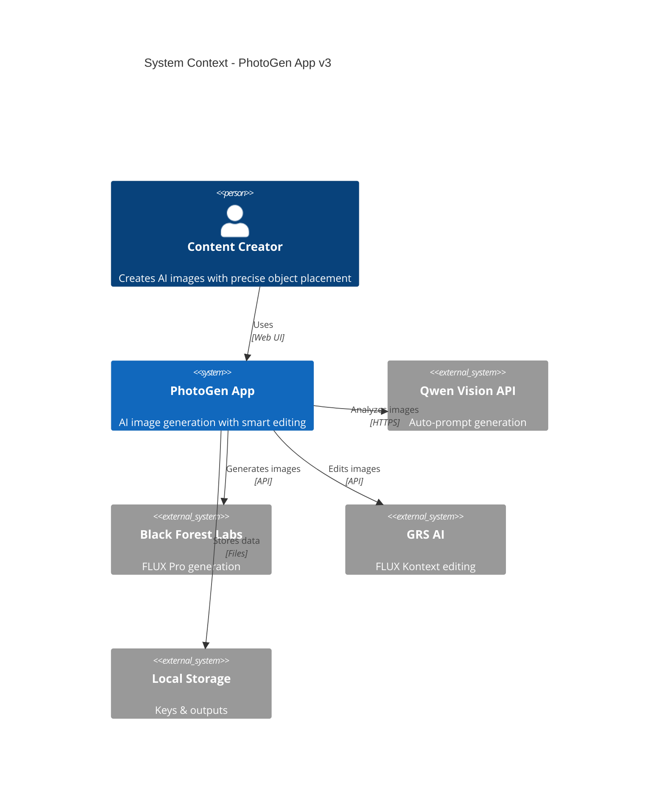
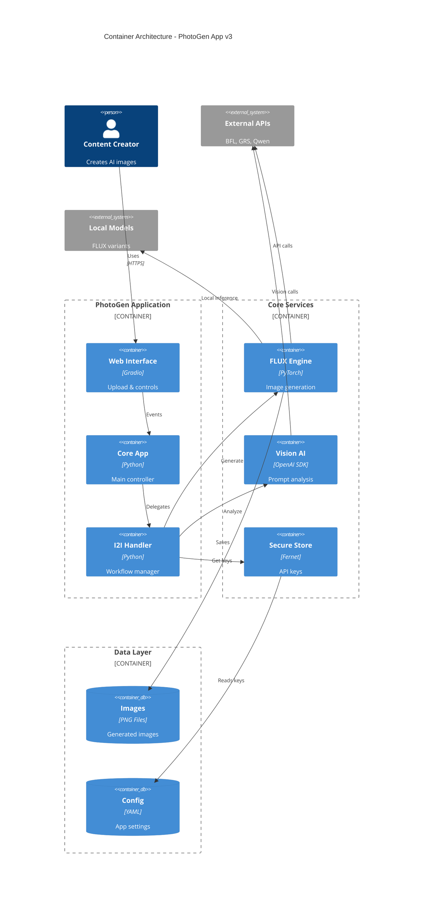
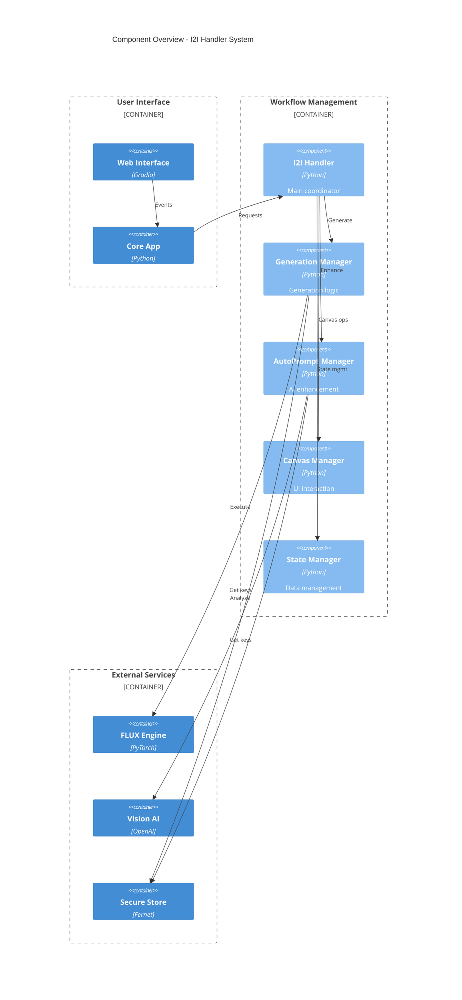

# PhotoGen App v3 - C4 Architecture Model

## Table of Contents
1. [Level 1: System Context](#level-1-system-context)
2. [Level 2: Container Architecture](#level-2-container-architecture├── C4 Context Diagram          (Who + Why)
├── C4 Container Diagram        (What + How)
├── Component Diagram            (Components + Responsibilities)
├── Class Diagram               (Code Structure + Methods)
└── Sequence Diagram            (Dynamic Interactions)
└── Data Flow Diagram           (Information Flow)[Level 3: Component Overview](#level-3-component-overview)
4. [Integration with Existing Diagrams](#integration-with-existing-diagrams)

---

## Level 1: System Context

### Simple overview: Who uses PhotoGen and what it connects to



**Key Points:**
- **User**: Content creators who need precise AI image generation
- **PhotoGen**: Your main application 
- **External APIs**: Qwen (vision), BFL & GRS (generation)
- **Storage**: Local files for keys and outputs

---

## Level 2: Container Architecture

### Technical building blocks: Main containers and their responsibilities



**Technology Stack:**
- **Frontend**: Gradio web interface
- **Backend**: Python with PyTorch for ML
- **Security**: Fernet encryption for API keys
- **Storage**: YAML config, PNG outputs

---

## Level 3: Component Overview

### Inside the I2I Handler: Key components and their interactions



**Manager Responsibilities:**
- **I2I Handler**: Main workflow coordinator (facade pattern)
- **Generation Manager**: Handles all generation logic and API calls
- **AutoPrompt Manager**: AI-powered prompt enhancement via vision
- **Canvas Manager**: User interface interactions and area selection
- **State Manager**: Application state and image management

*Note: Detailed class relationships are in your separate Class Diagram*

---

## Integration with Existing Diagrams

### How C4 Model Complements Your Current Documentation

| C4 Level | Diagram Purpose | Maps to Your Existing | Audience |
|----------|-----------------|----------------------|----------|
| **Level 1: Context** | System boundaries and external dependencies | Replaces parts of Deployment Diagram | Executives, Product Owners |
| **Level 2: Container** | Technical architecture and technology choices | Enhances Component Diagram with tech stack | Technical Leads, Architects |
| **Level 3: Component** | High-level component interactions | References your detailed Component Diagram | Senior Developers |
| **Level 4: Code** | **Your Class Diagram serves this purpose** | Detailed class relationships and methods | Developers, Code Reviewers |

### Recommended Documentation Set (Hybrid Approach)

✅ **Keep These Core Diagrams:**
- **C4 Context** (new) - For stakeholder communication
- **C4 Container** (new) - For technical architecture overview  
- **Class Diagram** (existing) - Detailed code structure (C4 Level 4)
- **Sequence Diagram** (existing) - Dynamic behavior and interactions
- **Data Flow Diagram** (existing) - Information flow patterns

🔄 **Simplified/Referenced:**
- **Component Diagram** - Keep but reference from C4 Level 3
- **State Diagram** - Simplify to key states only

❌ **Consider Removing:**
- **API Integration Detailed** - Information now distributed across C4 levels
- **Deployment Diagram** - Replaced by C4 Context diagram

### Documentation Hierarchy

```
📁 PhotoGen App v3 Architecture
├── 🎯 C4 Context Diagram          (Who + Why)
├── 🏗️  C4 Container Diagram        (What + How)
├── 📋 Component Diagram            (Components + Responsibilities)
├── 🔧 Class Diagram               (Code Structure + Methods)
├── 🎬 Sequence Diagram            (Dynamic Behavior)
└── 📊 Data Flow Diagram           (Information Flow)
```

This hybrid approach gives you:
- **Strategic overview** (C4 Context) for business stakeholders
- **Technical architecture** (C4 Container) for technical decision makers  
- **Implementation detail** (Class + Sequence) for development teams
- **Behavior understanding** (Data Flow + Sequence) for system analysis

Your PhotoGen documentation will now serve multiple audiences effectively while maintaining the detailed technical information developers need!
