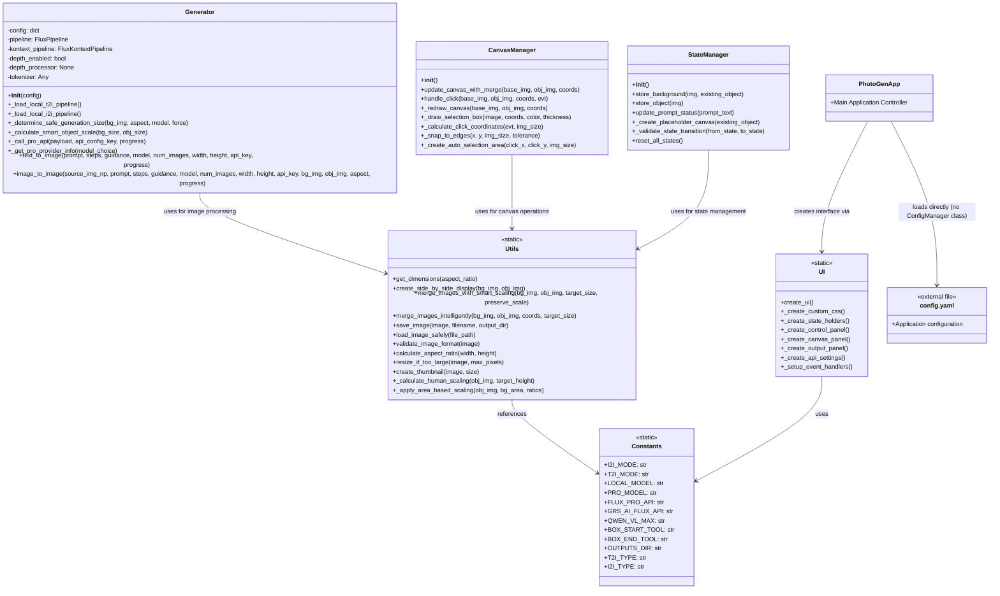

# PhotoGen App v3 - Comprehensive Class Diagrams

## 📋 Table of Contents
1. [Core Architecture Classes](#core-architecture-classes)
2. [Handler and Manager Classes](#handler-and-manager-classes)
3. [Vision and Enhancement Classes](#vision-and-enhancement-classes)
4. [Utility and Support Classes](#utility-and-support-classes)
5. [Complete Relationship Map](#complete-relationship-map)

---

## Core Architecture Classes

### Main Application Structure


---

## Handler and Manager Classes

### Complete Handler System Architecture


---

## Vision and Enhancement Classes

### AI-Powered Analysis and Enhancement


---

## Utility and Support Classes

### Core Utilities and Configuration



---

## Complete Relationship Map

### Full System Architecture with All Dependencies


---

## Detailed Method Signatures

### Key Method Details by Class

#### GenerationManager Methods
```python
run_generation(source_image: Image, object_image: Image, prompt: str, 
               aspect_ratio: str, steps: int, guidance: float, 
               model_choice: str, top_left: tuple, bottom_right: tuple, 
               progress: gr.Progress) -> list

_process_prompt_for_pro_model(prompt: str, object_image: Image, 
                             source_image: Image, model_choice: str) -> str

_execute_pro_generation(source_img: Image, object_img: Image, prompt: str,
                       width: int, height: int, steps: int, guidance: float,
                       model_choice: str, api_key: str, progress: gr.Progress) -> list
```

#### VisionAnalyzer Methods
```python
generate_comprehensive_auto_prompt(background_image: Image, object_image: Image,
                                  selection_coords: tuple, provider_name: str,
                                  api_key: str) -> str

_create_analysis_prompt(position_desc: str, has_object_image: bool) -> str

_post_process_prompt(raw_response: str) -> str
```

#### CanvasManager Methods
```python
handle_click(base_img: Image, obj_img: Image, top_left: tuple,
            bottom_right: tuple, evt: gr.SelectData) -> tuple

update_canvas_with_merge(base_img: Image, obj_img: Image,
                        top_left: tuple, bottom_right: tuple) -> Image

create_side_by_side_display(bg_img: Image, obj_img: Image) -> Image
```

---

## Design Patterns and Architectural Decisions

### Patterns Implemented
- **Manager Pattern**: Separate managers for distinct responsibilities (Generation, Canvas, State, AutoPrompt)
- **Strategy Pattern**: Multiple API providers with unified interface
- **Factory Pattern**: get_enhancer() function creates appropriate enhancer instances
- **Facade Pattern**: I2IHandler provides simplified interface to complex subsystem
- **Observer Pattern**: State changes trigger UI updates through Gradio
- **Template Method Pattern**: Enhancer base class defines enhancement workflow

### Key Architectural Benefits
- **Separation of Concerns**: Each manager handles specific domain logic
- **Extensibility**: Easy to add new API providers, enhancers, or generation methods
- **Testability**: Modular design enables unit testing of individual components
- **Security**: Centralized encrypted storage for sensitive API keys
- **Performance**: Lazy loading, async operations, and resource management
- **Maintainability**: Clear responsibilities and minimal coupling between components
