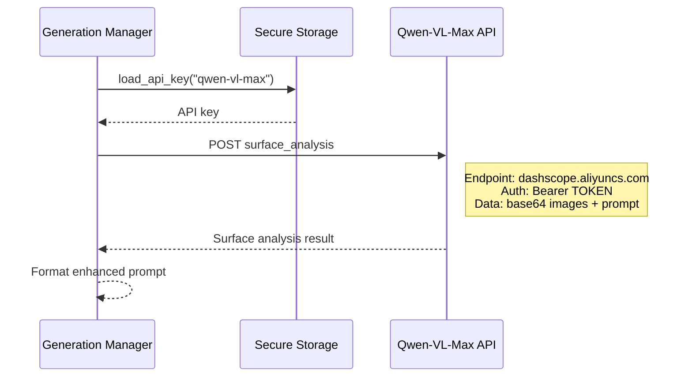
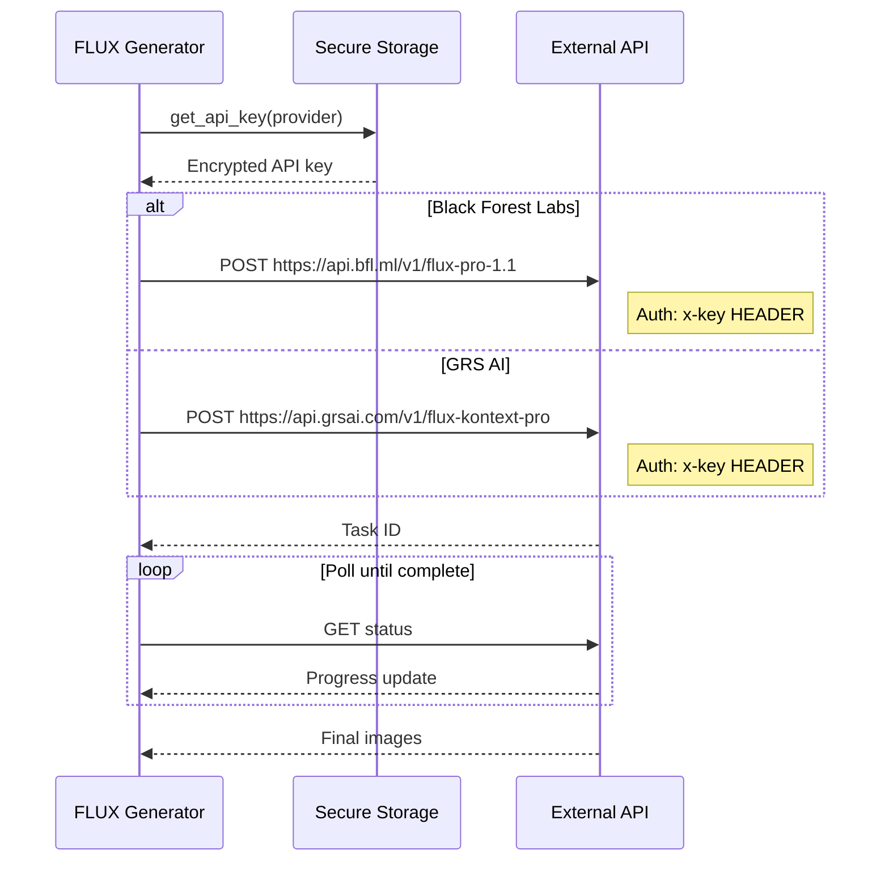
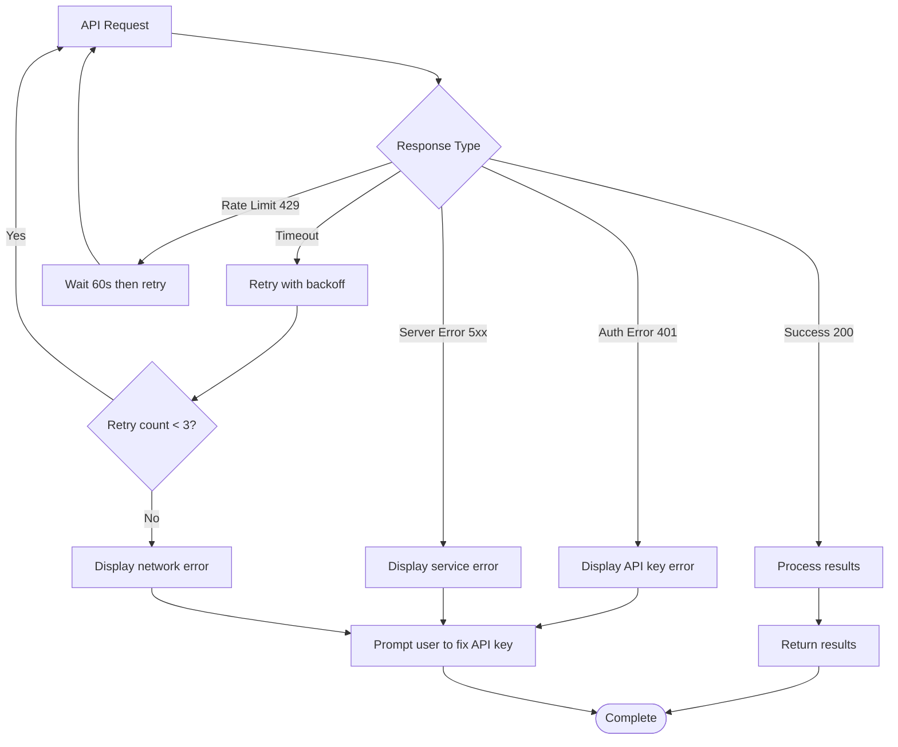

# PhotoGen App v3 - Clean Sequence Diagrams

## Table of Contents
1. [Main User Workflow](#main-user-workflow)
2. [API Call Sequences](#api-call-sequences)
3. [Mode-Specific Flows](#mode-specific-flows)
4. [Quick Reference](#quick-reference)

---

## Main User Workflow

### Complete Generation Process

```sequenceDiagram
    participant User
    participant UI as Gradio UI
    participant Handler as I2I Handler
    participant GenMgr as Generation Manager
    participant Generator as FLUX Generator
    participant Storage as File Storage

    Note over User, Storage: PhotoGen Complete Workflow

    %% Phase 1: Image Upload
    User->>UI: Upload images (1-10 files)
    UI->>Handler: process_uploads(files)
    Handler->>Handler: Validate and organize images
    Handler-->>UI: Display gallery + canvas

    %% Phase 2: Image Selection
    alt Multiple Images
        User->>UI: Select from gallery
        UI->>Handler: set_background_and_object(selected)
        Handler-->>UI: Update canvas with merged view
    else Single Image
        Handler->>Handler: Auto-set as background
        Handler-->>UI: Show single image canvas
    end

    %% Phase 3: Area Selection & Prompt Creation
    alt Canvas Area Selection + Auto-Prompt (Optional)
        User->>UI: Click on canvas to select area
        UI->>Handler: handle_click_with_prompt_button()
        Handler-->>UI: Show "🤖 Generate Smart Prompt" button
        User->>UI: Click "🤖 Generate Smart Prompt"
        UI->>GenMgr: auto_generate_prompt(images, coords)
        GenMgr->>GenMgr: Call Vision API for analysis
        GenMgr-->>UI: Return enhanced prompt
    else Manual Prompt
        User->>UI: Type custom prompt
    end

    %% Phase 4: Generation
    User->>UI: Click "Generate"
    UI->>GenMgr: run_generation(images, prompt, settings)
    
    GenMgr->>GenMgr: Determine mode and dimensions
    GenMgr->>Generator: execute_generation()
    
    alt Pro API Selected
        Generator->>Generator: Call external API
        Generator-->>GenMgr: API result
    else Local Model Selected
        Generator->>Generator: Use local FLUX
        Generator-->>GenMgr: Local result
    end
    
    GenMgr->>Storage: save_images(results)
    Storage-->>GenMgr: File paths
    GenMgr-->>UI: Display results
    UI-->>User: Show generated images

```

---

## API Call Sequences

### Vision API (Auto-Prompt)



### Generation APIs



---

## Mode-Specific Flows

### Create Mode (No Background)

```mermaid
flowchart TD
    Start([User starts generation]) --> Upload{Upload images?}
    
    Upload -->|No images uploaded| CreateMode[Create Mode Activated]
    Upload -->|Images uploaded| ProcessImages[Process and display in gallery]
    
    ProcessImages --> UserSelect[User clicks image from gallery]
    UserSelect --> EditMode[Edit Mode Activated]
    
    CreateMode --> T2IPrompt[Enter text prompt]
    T2IPrompt --> T2IGenerate[Text-to-Image Generation]
    T2IGenerate --> T2IResults[Show results]
    
    EditMode --> CanvasSelection{Click canvas area?}
    CanvasSelection -->|Yes| ShowAutoPrompt[Show "🤖 Auto-Prompt" button]
    CanvasSelection -->|No| ManualPrompt[Enter manual prompt]
    
    ShowAutoPrompt --> AutoPromptClick[User clicks "🤖 Auto-Prompt"]
    AutoPromptClick --> VisionAPI[Call Vision API for analysis]
    VisionAPI --> EnhancedPrompt[Return enhanced prompt]
    
    EnhancedPrompt --> I2IGenerate[Image-to-Image Generation]
    ManualPrompt --> I2IGenerate
    I2IGenerate --> I2IResults[Show results]
    
    T2IResults --> End([Complete])
    I2IResults --> End
```

### Error Handling Flow



---

## Quick Reference

### API Endpoints

| Service | Endpoint | Auth | Purpose |
|---------|----------|------|---------|
| **Qwen-VL-Max** | `dashscope.aliyuncs.com/api/v1/services/aigc/multimodal-generation/generation` | Bearer Token | Surface analysis |
| **Black Forest Labs** | `api.bfl.ml/v1/flux-pro-1.1` | x-key Header | Pro generation |
| **GRS AI** | `api.grsai.com/v1/flux-kontext-pro` | x-key Header | Kontext generation |

### User Action Triggers

| User Action | System Response | API Called |
|-------------|-----------------|------------|
| Upload images | Process and display gallery | None |
| Click on canvas area | Show "Auto-Prompt" button | None |
| Click "Auto-Prompt" | Analyze selected area for surfaces | Qwen-VL-Max |
| Click "Generate" | Create/edit images based on mode | BFL or GRS AI |
| Select aspect ratio | Calculate dimensions | None |
| Download result | Save to local file | None |

### Generation Modes

- **Create Mode**: No background → Text-to-Image generation
- **Edit Mode**: Background uploaded → Image-to-Image generation
- **Local Mode**: Use local FLUX models → No API calls
- **Pro Mode**: Use external APIs → API calls required

### Key Files

- `app.py` - Main application entry
- `core/handlers/generation_manager.py` - Generation workflow
- `core/generator.py` - FLUX model interface  
- `core/vision_streamlined.py` - Vision API integration
- `core/secure_storage.py` - API key management
