# PhotoGen App v3 - Workflow Documentation

## 📋 Table of Contents
1. [Core User Workflows](#core-user-workflows)
2. [API Integration](#api-integration) 
3. [System Architecture](#system-architecture)
4. [Technical Implementation](#technical-implementation)

---

## Core User Workflows

### 1. Image Upload and Selection

### 2. Prompt Creation

```mermaid
sequenceDiagram
    participant User
    participant UI as Gradio UI
    participant Vision as Vision API
    participant Handler as Generation Handler

    alt Auto-Prompt (Optional)
        User->>UI: Click "🤖 Generate Smart Prompt"
        UI->>Vision: analyze_images(background, object)
        Vision-->>UI: Return surface analysis
        UI-->>User: Display enhanced prompt
    else Manual Prompt
        User->>UI: Type custom prompt
    end
    
    User->>UI: Click "🚀 Generate"
    UI->>Handler: run_generation(images, prompt, settings)
```

### 3. Image Generation Flow

---

## API Integration

### API Endpoints and When They're Called

| **Service** | **Endpoint** | **When Called** | **Purpose** |
|-------------|--------------|-----------------|-------------|
| **Qwen-VL-Max** | `https://dashscope.aliyuncs.com/api/v1/services/aigc/multimodal-generation/generation` | Auto-prompt generation | Surface analysis |
| **Black Forest Labs** | `https://api.bfl.ml/v1/flux-pro-1.1` | Image generation | Professional T2I/I2I |
| **GRS AI** | `https://api.grsai.com/v1/flux-kontext-pro` | Image generation | Kontext-optimized generation |

### API Authentication
- **Qwen-VL-Max**: `Authorization: Bearer API_KEY`
- **BFL & GRS**: `x-key: API_KEY`

### API Call Sequence

---

## System Architecture

### Core Components

### Data Flow

1. **Upload**: User uploads images → Handler processes → Utils merges if needed
2. **Prompt**: User creates prompt (manual or auto-generated via Vision API)
3. **Generate**: Handler coordinates generation via appropriate API or local model
4. **Results**: Generated images saved to file system and displayed to user

---

## Technical Implementation

### Mode Detection

| **Mode** | **Trigger** | **Behavior** |
|----------|-------------|--------------|
| **Create Mode** | No background uploaded | Uses text-to-image generation |
| **Edit Mode** | Background uploaded | Uses image-to-image generation |

### Dimension Handling

- **Create Mode**: Uses selected aspect ratio (16:9, 3:4, etc.)
- **Edit Mode**: Can force aspect ratio or match input image
- **Safety Limits**: Local (1536×1536), Pro (2048×2048)

### Error Handling

### Configuration

- **Models**: FLUX.1-Kontext-dev (local), flux-1-kontext-pro (API)
- **Defaults**: 25 steps, 2.5 guidance scale
- **Security**: API keys encrypted with Fernet
- **Storage**: Generated images saved to `outputs/` with timestamps

---

## Quick Reference

### User Actions → System Response
1. **Upload Images** → Process and display in gallery
2. **Select from Gallery** → Update canvas with selected images  
3. **Click Auto-Prompt** → Call Vision API for surface analysis
4. **Enter Manual Prompt** → Process prompt for generation
5. **Click Generate** → Call appropriate API or use local model
6. **View Results** → Display generated images with download option

### Key Files
- `app.py` - Main application entry point
- `core/handlers/generation_manager.py` - Generation workflow
- `core/generator.py` - FLUX model interface
- `core/vision_streamlined.py` - Vision API integration
- `core/secure_storage.py` - API key management
